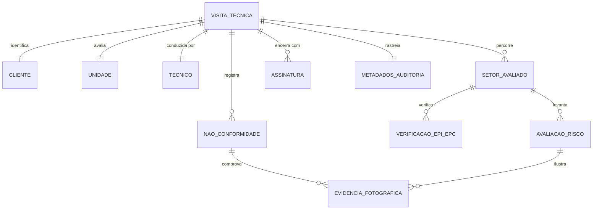
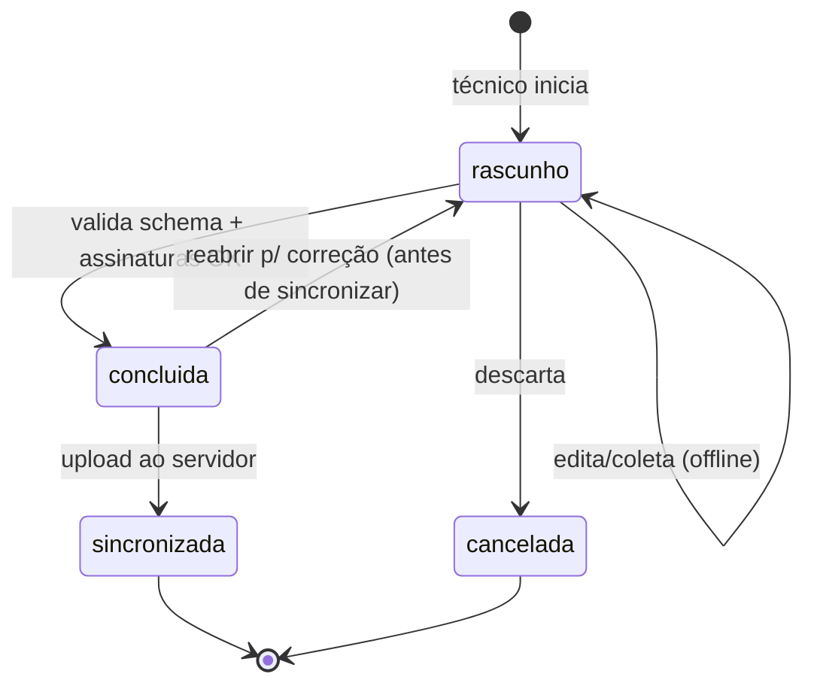

# SST-01 — Arquitetura e Estrutura de Dados do Check-list de Visita Técnica

> **Status:** `[RASCUNHO - AGUARDA REVISÃO]`
> **Empresa:** Select Ocupacional — Departamento Técnico
> **Objetivo da issue:** Definir o modelo de dados e as decisões de arquitetura que servirão de base para todo o desenvolvimento da aplicação de Check-list de Visita Técnica (SST/Saúde Ocupacional).
> **Entregáveis desta issue:**
> 1. Este documento de arquitetura.
> 2. `schema/checklist-visita-tecnica.schema.json` — contrato de dados formal (JSON Schema 2020-12).
> 3. `schema/exemplo-checklist-preenchido.json` — instância de exemplo válida contra o schema.

---

## 1. Princípios de arquitetura

Decisões fundamentais que orientam toda a modelagem, derivadas dos requisitos do `README.md` e do `CLAUDE.md` do projeto:

| # | Princípio | Motivação |
|---|-----------|-----------|
| P1 | **Offline-first** | O técnico realiza vistorias em campo (galpões, subsolos, áreas rurais) muitas vezes sem sinal. A coleta precisa funcionar 100% offline e sincronizar depois. |
| P2 | **Mobile-first / toque** | Uso primário em celular e tablet. A estrutura de dados favorece formulários curtos, agrupados por seções e com respostas de toque único (enum) sempre que possível. |
| P3 | **Identificadores próprios do cliente (UUID)** | Cada registro nasce no dispositivo com um `id` UUID v4 gerado localmente, garantindo unicidade sem depender do servidor e permitindo sincronização sem colisão. |
| P4 | **Integridade antes do envio** | Validação obrigatória no dispositivo (campos obrigatórios, tipos, enums) antes de permitir a finalização. O JSON Schema é a fonte única de verdade dessa validação. |
| P5 | **Sigilo e LGPD** | Dados pessoais (CPF do responsável, assinaturas, fotos que possam expor trabalhadores) são sensíveis. Campos sensíveis marcados no schema; ver seção 7. |
| P6 | **Rastreabilidade e versionamento** | Todo registro carrega metadados de auditoria (quem, quando, versão do app, versão do schema) para reprodutibilidade e conformidade. |
| P7 | **Desacoplamento do banco** | A stack final está `[A definir]`. O modelo é descrito em JSON Schema (agnóstico), servindo tanto para um banco documental (ex.: Firestore/Mongo) quanto relacional (mapeamento sugerido na seção 6). |

---

## 2. Visão geral do domínio

Uma **Visita Técnica** é o registro-raiz (agregado). Ela contém a identificação do cliente/unidade, um conjunto de **seções de avaliação** (riscos ocupacionais, EPIs/EPCs), as **não-conformidades** com suas **evidências fotográficas**, e o **encerramento** com assinaturas.

---

## 3. Entidades e atributos

### 3.1 `VisitaTecnica` (raiz do agregado)

| Campo | Tipo | Obrigatório | Observações |
|-------|------|:----------:|-------------|
| `id` | UUID v4 | ✅ | Gerado no dispositivo. |
| `codigo_visita` | string | ⬜ | Código legível/sequencial atribuído no back-end após sincronização. |
| `status` | enum | ✅ | `rascunho` \| `concluida` \| `sincronizada` \| `cancelada`. |
| `data_visita` | date (`YYYY-MM-DD`) | ✅ | Data da vistoria em campo. |
| `hora_inicio` | time (`HH:mm`) | ✅ | |
| `hora_fim` | time (`HH:mm`) | ⬜ | Preenchido no encerramento. |
| `cliente` | objeto `Cliente` | ✅ | Ver 3.2. |
| `unidade` | objeto `Unidade` | ✅ | Ver 3.3. |
| `tecnico` | objeto `Tecnico` | ✅ | Ver 3.4. |
| `setores` | array `SetorAvaliado` | ✅ (≥1) | Ver 3.5. |
| `nao_conformidades` | array `NaoConformidade` | ⬜ | Ver 3.8. |
| `assinaturas` | array `Assinatura` | ✅ (≥1) | Exigida na finalização. Ver 3.10. |
| `observacoes_gerais` | string | ⬜ | Texto livre. |
| `auditoria` | objeto `MetadadosAuditoria` | ✅ | Ver 3.11. |

> **Regra de negócio:** a transição `status` → `concluida` só é permitida se `assinaturas` contiver ao menos a assinatura do técnico **e** a do responsável da empresa, e se todos os campos obrigatórios validarem contra o schema (princípio P4).

### 3.2 `Cliente` (empresa visitada)

| Campo | Tipo | Obrigatório | Observações |
|-------|------|:----------:|-------------|
| `razao_social` | string | ✅ | Identificador principal (alinhado ao Gestão Click). |
| `nome_fantasia` | string | ⬜ | |
| `cnpj` | string (14 díg.) | ✅ | Validar dígito verificador no app. |
| `codigo_cliente_erp` | string | ⬜ | `[VERIFICAR CÓDIGO NO GESTÃO CLICK]` quando aplicável. |
| `contatos` | array `Contato` | ⬜ | **schema 1.5.0 (SST-06).** Múltiplos contatos. Substituiu `contato_nome`/`contato_telefone`. |

#### `Contato` (schema 1.5.0)

| Campo | Tipo | Obrigatório | Observações |
|-------|------|:----------:|-------------|
| `id` | UUID v4 | ✅ | |
| `nome` | string | ✅ | |
| `email` | string (email) | ⬜ | Validado (formato) no app. |
| `departamento` | string | ⬜ | Departamento/função do contato. |
| `telefone` | string | ⬜ | |

### 3.3 `Unidade`

| Campo | Tipo | Obrigatório | Observações |
|-------|------|:----------:|-------------|
| `nome` | string | ✅ | Ex.: "Matriz", "Filial CD Campinas". |
| `endereco` | objeto `Endereco` | ✅ | logradouro, numero, bairro, municipio, uf, cep. |
| `cnae_principal` | string | ⬜ | Classificação da atividade — base para grau de risco. |
| `grau_risco` | enum | ⬜ | `1` \| `2` \| `3` \| `4` (NR-04, conforme CNAE). `[VERIFICAR VIGÊNCIA DA NORMA]` |
| `numero_trabalhadores` | inteiro ≥ 0 | ⬜ | |

### 3.4 `Tecnico` (responsável pela vistoria)

| Campo | Tipo | Obrigatório | Observações |
|-------|------|:----------:|-------------|
| `id` | UUID/string | ✅ | Referência ao usuário autenticado. |
| `nome` | string | ✅ | |
| `funcao` | string | ⬜ | Ex.: Téc. Seg. Trabalho, Eng. Seg. Trabalho. |
| `registro_profissional` | string | ⬜ | Ex.: registro MTE / CREA quando aplicável. |

### 3.5 `SetorAvaliado`

Um setor/ambiente/posto percorrido durante a vistoria. Agrupa as avaliações daquele local.

| Campo | Tipo | Obrigatório | Observações |
|-------|------|:----------:|-------------|
| `id` | UUID v4 | ✅ | |
| `nome` | string | ✅ | Ex.: "Produção — Linha 2", "Almoxarifado". |
| `descricao` | string | ⬜ | |
| `funcoes` | array `FuncaoSetor` | ⬜ | **schema 1.3.0 (SST-08).** Funções do setor com nº de funcionários. Base para o GHE (SST-12). |
| `avaliacoes_risco` | array `AvaliacaoRisco` | ⬜ | Ver 3.6. |
| `verificacoes_epi_epc` | array `VerificacaoEpiEpc` | ⬜ | Ver 3.7. |

#### `FuncaoSetor` (schema 1.3.0)

| Campo | Tipo | Obrigatório | Observações |
|-------|------|:----------:|-------------|
| `id` | UUID v4 | ✅ | |
| `nome` | string | ✅ | Ex.: "Operador de prensa". |
| `quantidade` | inteiro ≥ 0 | ⬜ | Nº de funcionários naquela função no setor. |

### 3.6 `AvaliacaoRisco`

Levantamento de um agente de risco. A taxonomia segue os 5 grupos clássicos de riscos ocupacionais (base NR-09 / tabela de agentes nocivos do eSocial). `[VERIFICAR VIGÊNCIA DA NORMA]`

| Campo | Tipo | Obrigatório | Observações |
|-------|------|:----------:|-------------|
| `id` | UUID v4 | ✅ | |
| `grupo` | enum | ✅ | `fisico` \| `quimico` \| `biologico` \| `ergonomico` \| `acidente`. |
| `agente` | string | ✅ | Ex.: "Ruído contínuo", "Poeira de sílica". Ver catálogo sugerido no Apêndice A. |
| `fonte_geradora` | string | ⬜ | Ex.: "Compressor", "Corte de mármore". |
| `presente` | boolean | ✅ | Se o risco foi identificado no setor. |
| `nivel_exposicao` | enum | ⬜ | `nao_avaliado` \| `baixo` \| `medio` \| `alto` \| `avaliar`. **`avaliar`** (schema 1.2.0, SST-10) = requer quantificação instrumental. |
| `medidas_controle_existentes` | array de enum | ⬜ | `epc` \| `epi` \| `administrativa` \| `nenhuma`. |
| ~~`conforme`~~ | — | — | **Removido no schema 1.2.0** (SST-09): a conformidade deixou de ser avaliada por risco. |
| `observacao` | string | ⬜ | |
| `quantificacao` | objeto | ⬜ | **schema 1.4.0 (SST-11).** Medição instrumental: `data` (ISO), `hora` (`HH:mm`), `equipamento`. Relevante quando `nivel_exposicao = "avaliar"`. |
| `evidencias` | array `EvidenciaFotografica` (ref.) | ⬜ | Fotos ilustrativas do risco. |

### 3.7 `VerificacaoEpiEpc`

Verificação de uso e conformidade de EPI (individual) e EPC (coletivo).

| Campo | Tipo | Obrigatório | Observações |
|-------|------|:----------:|-------------|
| `id` | UUID v4 | ✅ | |
| `tipo` | enum | ✅ | `epi` \| `epc`. |
| `descricao` | string | ✅ | Ex.: "Protetor auricular tipo concha", "Enclausuramento de ruído". |
| `numero_ca` | string | ⬜ | Certificado de Aprovação — **obrigatório para EPI** (regra condicional no schema). |
| `fornecido` | boolean | ⬜ | Empregador fornece? |
| `em_uso` | boolean | ⬜ | Em uso no momento da vistoria? |
| `estado_conservacao` | enum | ⬜ | `bom` \| `regular` \| `ruim` \| `nao_aplicavel`. |
| `conforme` | enum | ✅ | `conforme` \| `nao_conforme` \| `nao_aplicavel`. |
| `observacao` | string | ⬜ | |

### 3.8 `NaoConformidade`

Registro consolidado de uma não-conformidade encontrada, com recomendação e prazo.

| Campo | Tipo | Obrigatório | Observações |
|-------|------|:----------:|-------------|
| `id` | UUID v4 | ✅ | |
| `descricao` | string | ✅ | |
| `origem_ref` | UUID | ⬜ | Referência ao `AvaliacaoRisco` ou `VerificacaoEpiEpc` que originou. |
| `gravidade` | enum | ✅ | `baixa` \| `media` \| `alta` \| `critica`. |
| `norma_referencia` | string | ⬜ | Ex.: "NR-06", "NR-12". `[VERIFICAR VIGÊNCIA DA NORMA]` |
| `recomendacao` | string | ✅ | Ação corretiva sugerida. |
| `prazo_sugerido_dias` | inteiro ≥ 0 | ⬜ | |
| `evidencias` | array `EvidenciaFotografica` | ⬜ (⚠ ver regra) | Ver 3.9. |

> **Regra de negócio:** não-conformidade de gravidade `alta` ou `critica` **exige** ao menos uma `EvidenciaFotografica` (registro fotográfico da evidência — escopo do README).

### 3.9 `EvidenciaFotografica`

| Campo | Tipo | Obrigatório | Observações |
|-------|------|:----------:|-------------|
| `id` | UUID v4 | ✅ | |
| `arquivo_ref` | string | ✅ | Caminho local / chave de storage após upload (ex.: `visitas/{id}/fotos/{uuid}.jpg`). |
| `legenda` | string | ⬜ | |
| `capturada_em` | datetime ISO-8601 | ⬜ | Timestamp da captura. |
| `geolocalizacao` | objeto `{lat, lng}` | ⬜ | Coordenadas, quando autorizado pelo dispositivo. |

> **Nota de arquitetura:** a imagem binária **não** é embutida no JSON. Guarda-se apenas a referência (`arquivo_ref`); o binário sincroniza por storage de objetos separado, mantendo o payload leve para redes de campo.

### 3.10 `Assinatura`

| Campo | Tipo | Obrigatório | Observações |
|-------|------|:----------:|-------------|
| `id` | UUID v4 | ✅ | |
| `papel` | enum | ✅ | `tecnico` \| `responsavel_empresa`. |
| `nome` | string | ✅ | |
| `cargo` | string | ⬜ | |
| ~~`documento` (CPF)~~ | — | — | **Removido no schema 1.1.0** (SST-04-ajuste): minimização de dados LGPD. Não coletamos mais o CPF do responsável. |
| `assinatura_ref` | string | ✅ | Referência à imagem da assinatura (mesma lógica de storage das fotos). |
| `assinado_em` | datetime ISO-8601 | ✅ | |

### 3.11 `MetadadosAuditoria`

| Campo | Tipo | Obrigatório | Observações |
|-------|------|:----------:|-------------|
| `criado_em` | datetime ISO-8601 | ✅ | |
| `atualizado_em` | datetime ISO-8601 | ✅ | |
| `sincronizado_em` | datetime ISO-8601 | ⬜ | Nulo até a sincronização. |
| `dispositivo_id` | string | ⬜ | Identificador do aparelho de origem. |
| `versao_app` | string | ⬜ | Ex.: "1.0.0". |
| `versao_schema` | string | ✅ | Versão do contrato de dados (ex.: "1.0.0") — permite migração futura. |

---

## 4. Máquina de estados da Visita

---

## 5. Regras de validação (fonte única: o JSON Schema)

1. Todos os campos marcados ✅ são `required` no schema.
2. `cnpj`: 14 dígitos numéricos (`pattern`); validação de dígito verificador fica na camada de aplicação.
3. `numero_ca` é **condicionalmente obrigatório** quando `tipo = "epi"` (regra `if/then` no schema).
4. Enums restringem respostas de campo a valores fechados — favorece toque único (P2) e evita texto livre inconsistente.
5. `EvidenciaFotografica` obrigatória para `NaoConformidade` com `gravidade ∈ {alta, critica}` (regra `if/then`).
6. Datas em ISO-8601 no armazenamento; a camada de apresentação converte para `DD/MM/AAAA` (compatibilidade Gestão Click — `CLAUDE.md` §13).
7. `versao_schema` sempre presente para permitir migração de dados entre versões.

---

## 6. Mapeamento para persistência (referência, stack `[A definir]`)

**Opção documental (recomendada para offline-first):** uma coleção `visitas_tecnicas`, cada documento é uma `VisitaTecnica` completa (agregado único) — leitura/escrita atômica no dispositivo, sincronização por documento.

**Opção relacional:** normalizar em tabelas `visita_tecnica`, `setor_avaliado`, `avaliacao_risco`, `verificacao_epi_epc`, `nao_conformidade`, `evidencia_fotografica`, `assinatura`, ligadas por `visita_id`/`setor_id` (FKs). Binários (fotos/assinaturas) sempre em object storage, com a referência na tabela.

Em ambos os casos, o JSON Schema permanece como contrato de validação de entrada/saída.

---

## 7. Sigilo, LGPD e segurança dos dados

Conforme `CLAUDE.md` §10/§11 e LGPD (Lei 13.709/2018):

- **Campos sensíveis:** `Assinatura.documento` (CPF), `Assinatura.assinatura_ref`, `EvidenciaFotografica` que possa identificar trabalhadores.
- Marcar esses campos como `[CONFIDENCIAL]` nos relatórios gerenciais abertos — não expor CPF nem imagens de pessoas em saídas agregadas.
- Coleta de `geolocalizacao` apenas com permissão do dispositivo; é opcional.
- Recomenda-se criptografia em repouso no dispositivo e em trânsito na sincronização (a definir na fase de implementação/infra).

> ⚠️ Este documento **não** modela dados de saúde individuais (ASO/CID) — o check-list de visita técnica avalia **condições do ambiente e conformidade**, não prontuários. Caso o escopo evolua para incluir dados de saúde de trabalhadores, aplicar as regras reforçadas do `CLAUDE.md` §15 (eSocial-SST). `[VERIFICAR ESCOPO COM RESPONSÁVEL]`

---

## 8. Fora do escopo desta issue (SST-01)

- Implementação de UI/telas (mobile-first) — próxima(s) issue(s).
- Camada de sincronização e resolução de conflitos — a detalhar.
- Autenticação/gestão de usuários técnicos.
- Geração do relatório/laudo final em PDF a partir da visita.
- Definição da stack técnica final (`README.md` → "[A definir]").

---

## Apêndice A — Catálogo sugerido de agentes por grupo de risco

> Referência de apoio para autocompletar/selects na UI. Base: grupos clássicos de riscos ocupacionais (NR-09) e tabela de agentes nocivos do eSocial. **Confirmar vigência antes de uso normativo formal** — `[VERIFICAR VIGÊNCIA DA NORMA]`.

- **Físico:** ruído, vibração (mãos/braços e corpo inteiro), calor, frio, umidade, radiação ionizante, radiação não-ionizante, pressões anormais.
- **Químico:** poeiras (sílica, etc.), fumos metálicos, névoas, neblinas, gases, vapores, produtos químicos em geral.
- **Biológico:** vírus, bactérias, fungos, parasitas, bacilos.
- **Ergonômico:** levantamento/transporte manual de peso, exigência de postura inadequada, esforço físico intenso, ritmo/monotonia, trabalho em turnos/noturno, jornada prolongada, mobiliário inadequado.
- **Acidente (mecânico):** máquinas/equipamentos sem proteção, arranjo físico inadequado, eletricidade, incêndio/explosão, trabalho em altura, quedas, espaço confinado, animais peçonhentos, ferramentas defeituosas.
