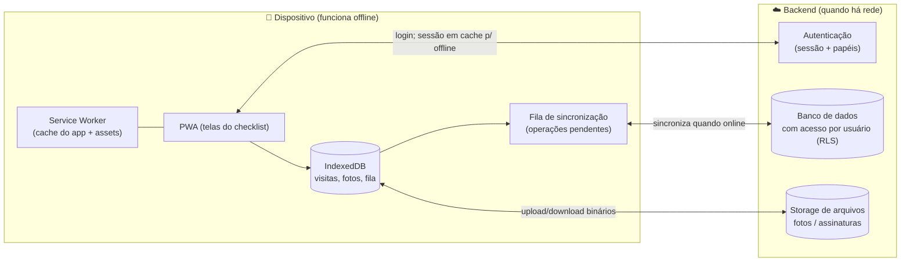

# SST-05 — Arquitetura da Plataforma: Web App Offline-First com Autenticação

> **Status:** `[APROVADO — decisões confirmadas em 2026-08-21]`
> **Empresa:** Select Ocupacional — Departamento Técnico
> **Objetivo da issue:** Definir a arquitetura para evoluir o protótipo estático atual em uma **aplicação web multiusuário com autenticação**, mantendo **execução 100% offline** e sincronização quando houver conexão. Esta issue é **decisão/spec** — não implementa código.
> **Pré-requisito das issues:** SST-16 (editar pós-fechamento + auditoria), SST-18 (salvar/editar centralizado), SST-15 (fotos em storage), autenticação e multiusuário dependem do que for decidido aqui.

---

## 1. Requisitos e restrições

| # | Requisito | Natureza |
|---|-----------|----------|
| R1 | **Offline-first (obrigatório):** coletar uma visita inteira sem internet — abrir o app, preencher, anexar fotos, assinar e salvar localmente. A rede é **opcional** e só serve para sincronizar. | Restrição dura |
| R2 | **Autenticação:** cada técnico entra com login próprio; o app identifica o autor de cada visita e de cada edição. | Funcional |
| R3 | **Login utilizável offline:** em campo sem sinal, o técnico precisa abrir e usar o app já autenticado (sessão em cache). | Restrição dura |
| R4 | **Salvar / editar / listar** várias visitas por técnico, com sincronização entre dispositivos. | Funcional |
| R5 | **Trilha de auditoria:** editar após o fechamento registrando quem/quando/o quê mudou. | Funcional |
| R6 | **LGPD / sigilo:** dados pessoais (CPF, e-mail) e sensíveis (assinaturas, fotos que identifiquem trabalhadores) protegidos em trânsito e em repouso; acesso restrito por usuário. | Restrição dura |
| R7 | **Mobile-first:** uso primário em celular/tablet em campo. | Restrição dura |
| R8 | **Instalável:** abrir como um app na tela inicial, sem depender do navegador aberto. | Desejável |

> **Consequência central:** offline-first + autenticação + multiusuário ⇒ arquitetura **local-first com sincronização** (não um SPA online que fala com um servidor a cada clique). O servidor é a fonte de convergência; o dispositivo é a fonte de trabalho.

---

## 2. Modelo arquitetural recomendado

**Local-first PWA + fila de sincronização + backend (BaaS).**

**Como funciona na prática:**
1. O app (PWA) é **cacheado pelo Service Worker** → abre e roda mesmo sem internet.
2. Todo dado da visita é gravado **primeiro no IndexedDB** (local). O trabalho nunca depende da rede.
3. Cada alteração vira uma **operação na fila de sincronização**.
4. Quando há conexão, a fila sobe para o backend e baixa o que mudou em outros dispositivos.
5. A **autenticação** ocorre online; a **sessão fica em cache** para o app abrir autenticado offline (R3).

---

## 3. Decisões técnicas (recomendação + alternativas)

### 3.1 Execução offline → **PWA** (Service Worker + Web App Manifest)
Transforma o site atual em app instalável que roda offline. É a base do R1/R3/R8.
- **Recomendado:** adotar um build com plugin de PWA (ex.: **Vite + vite-plugin-pwa**) que gera o Service Worker e o manifest automaticamente.
- Alternativa sem build: Service Worker escrito à mão (mais trabalhoso de manter conforme o app cresce).

### 3.2 Armazenamento local → **IndexedDB** (migrar do localStorage)
O `localStorage` atual **não escala** para o que vem (várias visitas, fotos, fila de sync). O IndexedDB comporta blobs (fotos/assinaturas) e volumes maiores.
- **Recomendado:** usar uma camada fina sobre IndexedDB (ex.: **Dexie.js** ou **idb**) para não escrever IndexedDB "cru".
- Migração: os rascunhos hoje em `localStorage` são convertidos na primeira abertura da nova versão.

### 3.3 Sincronização → **fila de operações + convergência por registro**
- Cada visita tem `id` (UUID) próprio do dispositivo (já temos) e metadados de auditoria (já temos `criado_em`/`atualizado_em`/`sincronizado_em`).
- **Estratégia de conflito recomendada:** convergência **por registro**, *last-write-wins* usando `atualizado_em` — simples e adequado, já que uma visita normalmente pertence a **um** técnico. Conflitos reais serão raros.
- A fila é idempotente (reenviar a mesma operação não duplica) e resiliente a rede intermitente.

### 3.4 Backend → **BaaS** (Backend as a Service)
Evita construir/operar servidor próprio agora e já entrega Auth + Banco + Storage + regras de acesso.

| Opção | Prós | Contras | LGPD |
|---|---|---|---|
| **Supabase** *(recomendado)* | Postgres real, **Row Level Security** (acesso por usuário no próprio banco), Auth e Storage integrados, SQL alinhado ao nosso schema relacional | offline não é nativo (usamos IndexedDB + fila por nossa conta) | Forte: RLS, escolha de região, dado em Postgres |
| **Firebase** | **Persistência offline nativa** do Firestore, Auth e Storage maduros | NoSQL (remodelar dados), *lock-in* Google, residência de dados menos flexível | Média: exige cuidado com região/retenção |
| **Backend próprio** (Node + Postgres) | Controle total | Muito mais esforço, precisa operar/segurar infra | Depende inteiramente de nós |

> **Recomendação:** **Supabase**. O Postgres com RLS casa com o schema da SST-01, dá controle de acesso por usuário no nível do banco (bom para LGPD) e cobre Auth + Storage. O offline fica por nossa conta (IndexedDB + fila), que precisaríamos ter de qualquer forma para o R1.

### 3.5 Autenticação → e-mail/senha + **sessão em cache** para offline
- Papéis: `tecnico` (coleta) e `admin` (gestão/relatórios) — expansível.
- Sessão persistida localmente para abrir o app autenticado sem rede (R3), com expiração e renovação quando voltar online.
- **Primeiro login exige internet** (para autenticar) — é uma limitação aceitável; depois funciona offline.

### 3.6 Fotos e assinaturas → binário local → **Storage** na sincronização
- Já previsto no schema (SST-01): guardamos **referência** (`arquivo_ref`), não o binário embutido.
- Offline: binário no IndexedDB. Online: sobe para o bucket e a referência vira a chave do storage.

### 3.7 Relatório em PDF → **gerado no cliente** (funciona offline)
- Biblioteca client-side (ex.: **pdf-lib** ou **jsPDF**) para gerar o laudo a partir da visita **sem depender do servidor** — coerente com o offline-first.

### 3.8 Frontend → **decisão em aberto** (ver §7)
O app cresceu (4 telas → 5+ telas, GHE, treinamentos, auth, sync). Duas rotas:
- **(a) Manter Vanilla JS modular + introduzir só um build (Vite)** — menor ruptura, reaproveita todo o código atual.
- **(b) Adotar um framework leve (ex.: Svelte ou Vue) + Vite** — melhor para estado/telas que vão ficar mais complexas, porém reescreve parte da UI.

---

## 4. Segurança e LGPD

Conforme `CLAUDE.md` §10/§11 e LGPD (Lei 13.709/2018):
- **Acesso por usuário** no banco (RLS): um técnico só enxerga as próprias visitas (ou conforme papel).
- **Criptografia em trânsito** (HTTPS) e **em repouso** (banco/Storage do provedor); IndexedDB no dispositivo com dados mínimos necessários.
- **Minimização de dados:** o **CPF do responsável foi removido** da coleta (decisão §7) — guardamos apenas nome, cargo e assinatura. Menos dado pessoal = menos risco.
- **Dados sensíveis** remanescentes (assinaturas; fotos que eventualmente identifiquem pessoas) marcados como `[CONFIDENCIAL]` e nunca expostos em relatórios agregados; orientar o técnico a fotografar **o risco**, não trabalhadores.
- **Retenção e exclusão**: definir prazo de guarda e rotina de expurgo (a combinar com o responsável).
- **Consentimento/base legal**: o app trata dado de terceiros (responsável da empresa visitada) — revisar a base legal com o responsável antes de produção.

> ⚠️ Migrar de "dados só no dispositivo" para "dados centralizados na nuvem" **eleva a responsabilidade de proteção de dados**. Esta é uma decisão de negócio, não só técnica. `[VERIFICAR ESCOPO COM RESPONSÁVEL]`

---

## 5. Caminho de migração (incremental, sem quebrar o que existe)

Cada passo entrega valor e é reversível:

1. **PWA-ready:** adicionar build (Vite) + manifest + Service Worker → app instalável e offline (sem mudar telas).
2. **IndexedDB:** migrar a persistência local do `localStorage` para IndexedDB; suportar **múltiplas visitas** (base para "salvar/editar/listar").
3. **Relatório PDF** (client-side) — independe de backend, pode entrar cedo.
4. **Backend + Auth** (Supabase): login, papéis, banco com RLS, Storage.
5. **Sincronização:** fila de operações, upload de fotos/assinaturas, convergência por registro.
6. **Edição pós-fechamento + trilha de auditoria** (agora com base multiusuário/servidor).

Os itens de **estrutura de tela da Fase 1** (SST-06, 08, 09, 10, 11) **independem** disso e podem avançar em paralelo — migram junto, pois só mexem no schema/UI.

---

## 6. Como o backlog se encaixa

| Item do backlog | Depende desta arquitetura? |
|---|---|
| SST-06/08/09/10/11 (estrutura de telas) | ❌ Não — schema+UI, roda no app atual |
| SST-07 (CNAE→grau) | ❌ Não — dado de referência |
| SST-12 (GHE) / SST-13 (Treinamentos) | ❌ Não p/ a UI; ✔ p/ sincronizar |
| SST-14 (botões +) | ❌ Não |
| SST-15 (fotos) | ⚠️ UI offline sim; storage real depende de §3.6 |
| SST-16 (editar pós-fechamento + auditoria) | ✔ Sim |
| SST-17 (PDF) | ❌ Não (client-side) |
| SST-18 (salvar/editar/listar) | ⚠️ Local sim; centralizado depende do backend |
| SST-19 (SOC/"Modelo 1") | Externo — depende de acesso/API |

---

## 7. Decisões confirmadas (2026-08-21)

- [x] **Backend/BaaS:** **Supabase** — plano **Free** neste primeiro momento.
- [x] **Frontend:** **Vanilla JS + Vite** (mantém o código atual; adiciona build + PWA).
- [x] **Usuários / papéis:** **Técnicos** e **Administradores**. Cliente **não** tem acesso.
- [x] **Assinatura digital:** **canvas** (a atual) — **sem** exigência de validade jurídica.
- [x] **CNAE:** confirmado; usar o **Quadro I da NR-04** como fonte do grau de risco (`[VERIFICAR VIGÊNCIA DA NORMA]`).
- [x] **Dados do responsável:** **remover o CPF**. Coletar apenas **nome, cargo e assinatura** — reduz a exposição LGPD. (Impacta o schema e a Tela 4.)
- [x] **Fotos:** finalidade = **identificar riscos no cliente** (não retratar pessoas). Orientar o técnico a evitar rostos/identificação de trabalhadores.
- [~] **SOC / "Modelo 1":** *"Modelo 1"* é o documento preenchido no **SOC** com dados do funcionário e de SST. O SOC expõe **APIs / Web Service** e temos **acesso de administrador** — falta obter/analisar a **documentação da API**. Fica como **SST-19 (integração)**, dependente dessa documentação.
- [ ] **Retenção/expurgo** de dados e **base legal** LGPD para dados de terceiros — a alinhar com o responsável antes de produção (não bloqueia o desenvolvimento).

## 8. Fora de escopo desta issue (SST-05)
- Implementação do build/PWA, do IndexedDB, do backend ou da sincronização (viram issues próprias após aprovação desta arquitetura).
- Definição visual do laudo PDF (depende de modelo a fornecer).
